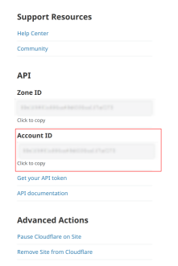
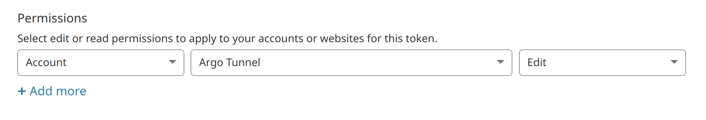

[](https://circleci.com/gh/giantswarm/cloudflared-app)

# cloudflared chart

Giant Swarm offers a cloudflared App which can be installed in workload clusters.
Here we define the cloudflared chart with its templates and default configuration.

## What is this app?
This app allows you to launch [Cloudflare Argo Tunnels](https://www.cloudflare.com/en-gb/products/argo-tunnel/)
and then route directly to services inside of your cluster. This approach
bypasses any external ingress paths and can also be configured to bypass
Kubernetes Ingress

## Why did we add it?
This approach makes it a lot easier for customers who might be constrained in
regards to ingress options (such as limited external load balancer services or
for security reasons). It is especially useful for clusters that are OnPrem and
not running in a Public Cloud provider, as it allows those users to route
traffic from a public interface (Cloudflare) to private services running in Kubernetes.

## Who can use it?
Anyone that has a Cloudflare account can use this App.


## Installing

There are 3 ways to install this app onto a workload cluster.

1. [Using our web interface](https://docs.giantswarm.io/ui-api/web/app-platform/#installing-an-app)
2. [Using our API](https://docs.giantswarm.io/api/#operation/createClusterAppV5)
3. Directly creating the [App custom resource](https://docs.giantswarm.io/ui-api/management-api/crd/apps.application.giantswarm.io/) on the management cluster.

(Note: It is possible to use the chart in this repository directly)

## Configuring

### Prerequisites
In order to use this you will need to ensure you have the following:

- Email address to login to Cloudflare API
- Cloudflare Account ID


- Cloudflare API token with `Account:Argo Tunnel:Edit` capability



#### Optional
The Tunnel requires a secret to launch, if one is not supplied the App can
create one for you. But as this secret is essential for launching the tunnel it
must be saved securely to ensure that you can launch the tunnel elsewhere if
needed.

You can supply your own secret:

```bash
 uuidgen | base64 | kubectl create secret -n my-argo-tunnel generic my-tunnel-secret --from-file=tunnelSecret=/dev/stdin
```

The tunnel secret needs to be 32 bytes or more and needs to be stored base64
encoded.

You can later supply the Kubernetes secret name.

### values.yaml
|Value                  |Description|Default|
|-----------------------|-----------|-------|
|`namespace`            | Namespace in which to launch the App        | `kube-system` |
|`serviceType`          | Giant Swarm service definition              | `managed` |
|`initImage.registry`   | Registry used for the init container image  | `quay.io` |
|`initImage.name`       | Image name used for the init container      | `giantswarm/debug` |
|`initImage.tag`        | Tag of init container image                 | `master` |
|`initImage.pullPolicy` | Init container image Pull Policy            | `IfNotPresent` |
|`image.registry`       | Registry used for cloudflared               | `quay.io` |
|`image.name`           | Image name for cloudflared                  | `giantswarm/cloudflared` |
|`image.tag`            | Tag used for cloudflared image              | `2021.2.5` |
|`image.pullPolicy`     | Pull policy for cloudflared image           | `IfNotPresent` |
|`accountEmail`         | Account Email to use for the API (required) | `""` |
|`accountId`            | Account ID (see above, required)            | `""` |
|`apiKey`               | API key used for the API (see above, required or `apiKeySecretName` needs to be set) | `""` |
|`apiKeySecretName`     | Name of existing secret that containers the API Key, the API key needs to be stored in a key in the secret called `apiKey` (required or `apiKey` needs to be set) | `""` |
|`tunnelSecretBase64`   | Base64 encoded Tunnel Secret (see above, required or `tunnelSecretName` needs to be set | `""` |
|`tunnelSecretName`     | Name of existing secret container Tunnel Secret, the tunnel secret needs to be stored in a key in the secret called `tunnelSecret` (required or `tunnelSecretBase64` needs to be set) | `""` |
|`config`               | Config file used for cloudflared. See [online documentation](https://developers.cloudflare.com/cloudflare-one/connections/connect-apps/configuration/config) | see `values.yaml` |


**This is an example of a values file you could upload using our web interface.**
```
# values.yaml
accountEmail: "xxxx@xxxxx.com"
accountId: "xxxxxxxxxxxxxxxxxxxxxxxxxxxx"
apiKey: "xxxxxxxxxxxxxxxxxxxxxxxxxxxxxxxx"
tunnelSecretBase64: "ZUY0xjNhZTgtNWI4MCx0ZjcvLTkxMOEt4zEyOWQyZDQpN8Y0Cg=="

config:
  no-tls-verify: false
  loglevel: "info"
  transport-loglevel: "info"
  ingress:
    - hostname: echo.xxxxxx.com
      service: http://echo-echo-server.default.svc.cluster.local
    - service: http_status:404

```

## Compatibility

This app has been tested to work with the following workload cluster release versions:

*

## Limitations

Some apps have restrictions on how they can be deployed.
Not following these limitations will most likely result in a broken deployment.

*

## Credit

* https://github.com/giantswarm/cloudflared-app
